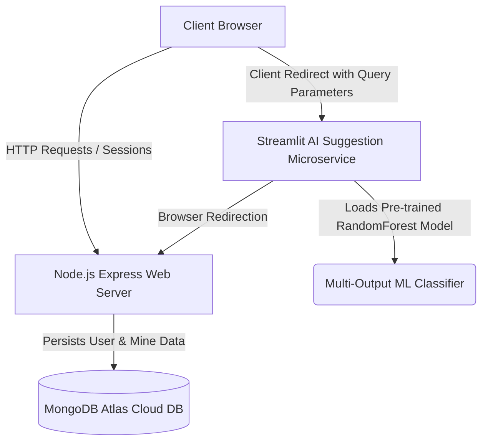

# 🌿 EcoMine — Unified Coal Mine Carbon Calculator & AI Suggestion Engine

EcoMine is a premium, production-grade hybrid web application designed to measure, visualize, and mitigate carbon emissions in coal mining operations. 

By combining a Node.js/Express web dashboard, a Python/Streamlit machine learning suggestions microservice, and a cloud MongoDB Atlas database, EcoMine offers coal mining operators a seamless, data-driven path toward carbon neutrality.

---

## 🚀 Live Cloud Deployments

* **🌐 Live Web Application (Render):** [https://latestecomine.onrender.com](https://latestecomine.onrender.com)
* **📊 Live AI Suggestions Engine (Streamlit Cloud):** [https://ecomine-mn6i87hjr5wspkkamskdi3.streamlit.app/](https://ecomine-mn6i87hjr5wspkkamskdi3.streamlit.app/)

---

## 🛠️ Hybrid Architecture & Tech Stack

EcoMine leverages an integrated **two-tier microservice architecture** synced entirely via client-side routing, enabling modular, independent, and high-performance hosting in the cloud:



### Backend & Frontend Web Platform
* **Core:** Node.js, Express, Javascript, EJS (Embedded JavaScript Templates) with EJS-mate layouts.
* **Database & Sessions:** MongoDB Atlas cloud database, Mongoose ODM, and `connect-mongo` for robust database session persistence.
* **Styling & UI:** Vanilla CSS, custom HSL color systems, glassmorphism card designs, and Bootstrap 5.
* **Data Visualization:** Interactive line, bar, and pie charts built with Google Charts, Chart.js, and MapTiler APIs.

### AI & Suggestions Microservice
* **Framework:** Python, Streamlit.
* **Machine Learning:** Scikit-Learn (`RandomForestClassifier`, `MultiOutputClassifier`), Pandas, Numpy.
* **Visualizations:** Matplotlib pie charts and custom Streamlit data-grids.

---

## ✨ Key Features

### 1. 🧮 Multi-Factor Carbon Calculator
Estimates comprehensive Scope 1 and Scope 2 emissions based on four key operational inputs:
* **Combustion Footprint:** Calculates combustion intensities across Lignite, Sub-Bituminous, Bituminous, and Anthracite coal types.
* **Electricity Footprint:** Evaluates indirect power emissions using grid consumption and national emission factors.
* **Transportation Footprint:** Tracks haul distances across diesel and petrol machinery.
* **Deforestation Footprint:** Quantifies carbon sink loss based on deforested land area and carbon stock values.

### 2. 🤖 Interactive Machine Learning Suggestions Engine
Redirects the user to an AI dashboard powered by a multi-output Random Forest Classifier. The engine dynamically offers high-impact reduction strategies customized to their exact emissions profile:
* **Afforestation Simulators:** Interactive slider to plan tree plantings, displaying real-time carbon reduction curves and new net emissions.
* **Renewable Options:** Dynamic evaluations for shifting to Solar, Wind, Geothermal, or Hydro power.
* **Heavy Machinery EV Transitions:** Suggestions for adopting Electric Haul/Dump Trucks and Wheel Loaders.
* **Methane Capture Systems:** Mitigation pathways for coal bed methane emissions.

### 3. 🛒 Seeded Carbon Credit Marketplace
A mock carbon-offset ecosystem allowing mining operators to purchase verified, certified credits (Amazon Reforestation, US Wind Farms, Indian Solar Grid, German Methane Capture) to offset their operational carbon footprint.

---

## 🔧 Production-Grade Optimizations & Bug Fixes

We identified, refactored, and successfully resolved several critical architectural blockers to prepare EcoMine for production-ready deployment:

1. **🔐 Resolved Express Authentication Race Conditions:** Express originally fired synchronous redirects (`res.redirect('/home')`) before the asynchronous database `MongoStore` session transaction successfully wrote to MongoDB. Added explicit `req.session.save()` callback wrappers on `/login` and `/signup` POST routes to guarantee session persistence before headers are sent.
2. **🧱 Standardized Auth Middleware Exports:** Corrected `auth/auth.js` exports to assign the `isAuthenticated` validation function to the router object (`router.isAuthenticated = isAuthenticated`), resolving imports in `main.js` and `marketplace.js` to restore routing security.
3. **🚨 Robust EJS Validation Feedback:** Integrated red Bootstrap alert validation panels on `login.ejs` and `signup.ejs` templates using robust EJS variable checks (`typeof error !== 'undefined' && error`) to replace silent failures with clear user feedback.
4. **📊 Streamlit Query Parameter Fallbacks:** Modified `ml_model.py` to gracefully handle direct traffic. When accessed without query parameters, it automatically defaults to a realistic sample dataset for an active coal mine, eliminating the raw `"Invalid input values"` block error.
5. **🛡️ MongoDB Reconnection Protection:** Refactored the Mongoose connection sequence in `main.js` with an `isConnecting` state guard and a 5-second throttled backoff timer, replacing the infinite, synchronous recursion loop that crashed the server.
6. **💾 Cloud Database Seeding Scripts:** 
   * Updated `importMines.js` and `deleteMines.js` to read from the `.env` database URL, automatically generating an admin seed user to bypass Mongoose relational schema validations.
   * Created [seedCredits.js](seedCredits.js) to seed the Carbon Credit Marketplace with verified projects.

---

## 🛠️ Local Installation & Quick Start

### 1. Prerequisite Settings
Clone this repository and create a `.env` file in the root directory:
```env
PORT=3000
MONGODB_URL="mongodb://127.0.0.1:27017/ecomine"
SESSION_SECRET="yoursecretkey123"
MAPTILER_API_KEY="your_maptiler_api_key"
```

### 2. Run the Node.js Express App
```bash
# Install dependencies
npm install

# Run database seeders (Requires local MongoDB Running)
node importMines.js
node seedCredits.js

# Start the local development server (Launches on port 3000)
npm run dev
```

### 3. Run the Streamlit AI Suggestions App
```bash
# Install Python dependencies
pip install -r requirements.txt

# Start the Streamlit server (Launches on port 8501)
streamlit run ml_model.py
```

---

🎉 **EcoMine is fully configured, live, and driving the future of green mining technology!**
